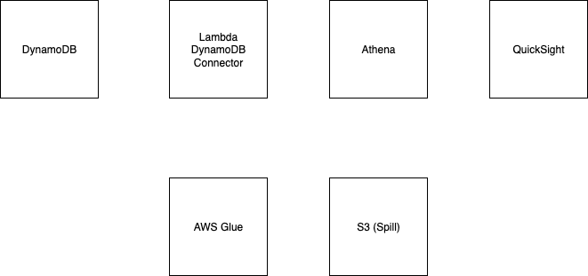
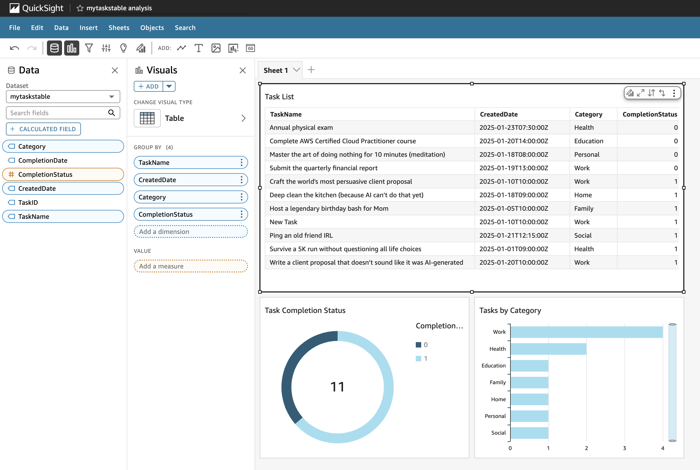

# AWS Project: QuickSight, Athena, DynamoDB, Lambda Connector

  

  

Note: The architecture diagrams and images in this repository were fully created by me to illustrate the project design and workflow.
This repo contains the code files used in this [YouTube video](https://youtu.be/d1ZsTwR7cB8).

